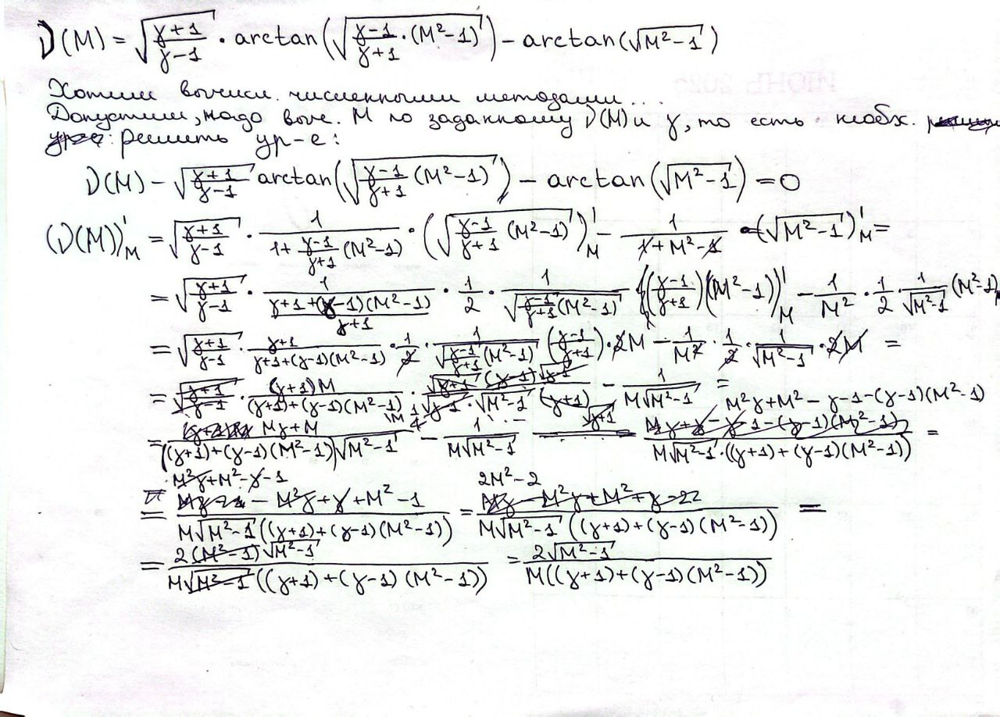
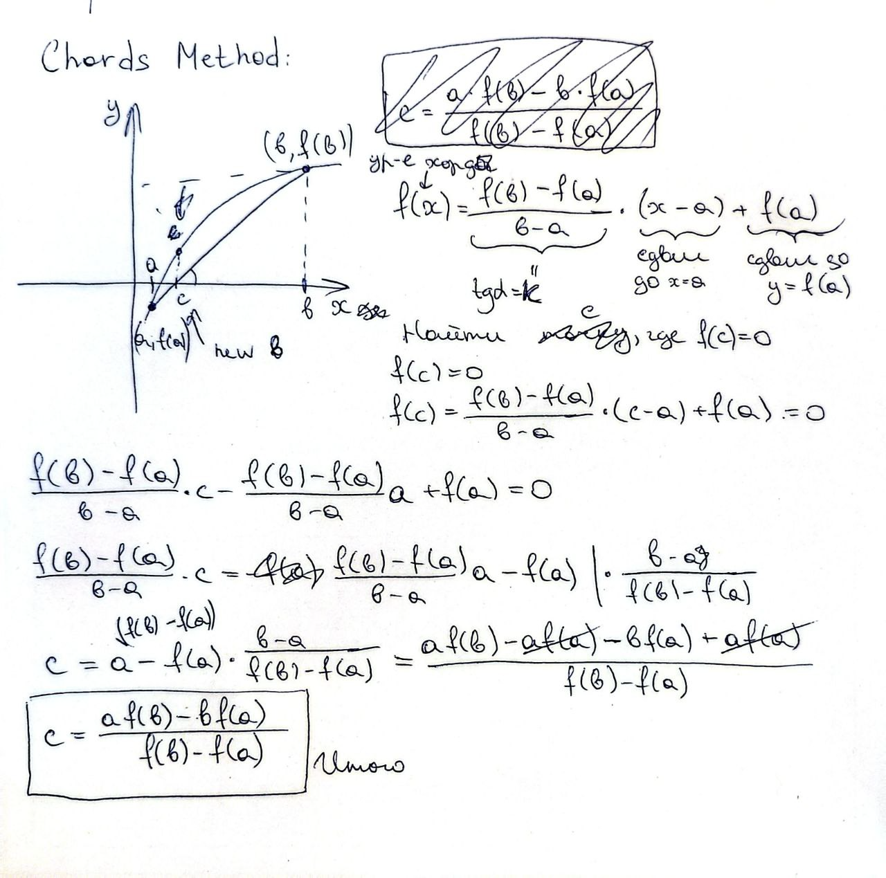

## Problem
Numerically find the root of the Prandtl–Meyer function.

## Defence
1. Code explanation. Proof of calculation accuracy (similarity of responses
from different methods, including);
2. Convergence rates of the applied methods.
